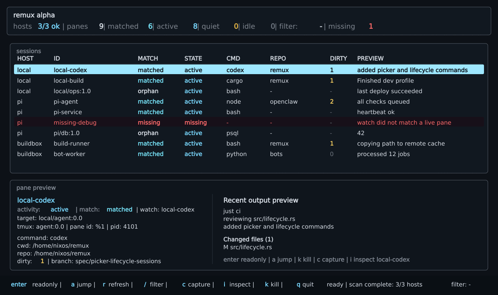
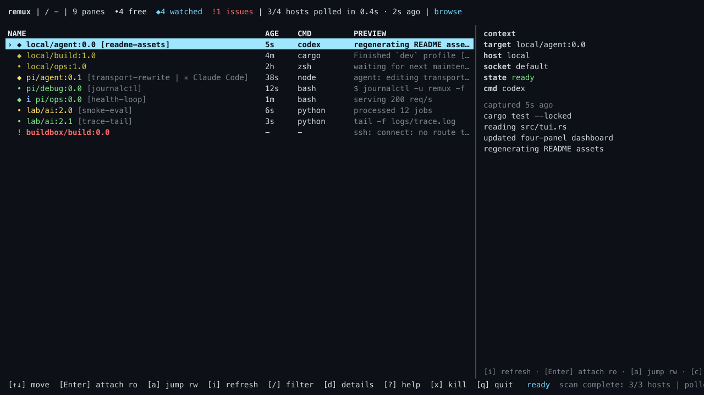

# remux

`remux` helps you find, inspect, and reattach to tmux panes across local and SSH hosts.

If you already use tmux across multiple machines, `remux` helps you answer:

- what is running
- where it is running
- whether it is still active
- how to get back to it

It reuses tmux and SSH. It does not require a daemon, a cloud service, or a new workflow.



## Why

If you keep long-lived shells, builds, agents, or debug sessions running in tmux across multiple hosts, it becomes easy to lose track of which pane is doing what.

`remux` gives you a cross-host view of live tmux panes so you can inspect the right one, capture output, and attach without manually checking each host.

## Why this instead of tmux built-ins, sesh, tmuxp, or fzf scripts?

`remux` is for a different problem.

- `tmux ls`, `list-sessions`, and `list-panes` tell you about one host at a time.
- `sesh`, `tmuxp`, and tmuxinator help create, restore, or switch between known sessions.
- ad hoc `ssh` + `fzf` + shell scripts can work, but usually need host-specific glue and do not give you one consistent inspect-and-attach flow.

`remux` is for the moment when the session already exists and the problem is:

- "I know I left this running somewhere."
- "Which host has the live pane I need?"
- "Show me the pane before I attach to it."
- "Let me jump back in without SSHing host-by-host."

## What remux is and is not

`remux` is:

- a cross-host index over live tmux panes
- a way to inspect command, cwd, repo, activity, and watch state
- a fast path to capture output or attach read-only/read-write

`remux` is not:

- a tmux replacement
- a session-layout tool like tmuxinator or tmuxp
- a daemon or cloud sync service
- an agent orchestrator
- an AI layer

## Quick start

### Install

#### Homebrew

```bash
brew tap camerondurham/tap
brew install remux
```

#### Nix

```bash
nix profile install github:camerondurham/remux
```

#### Build from source

```bash
cargo install --path .
mkdir -p ~/.config/remux
cp examples/config.yaml ~/.config/remux/config.yaml
```

### Configure

Generate a starter config:

```bash
remux onboard
remux onboard --write
```

If `~/.ssh/config` has aliases, `remux onboard` will prompt you to choose which ones to include.

If you want to limit the generated SSH hosts:

```bash
remux onboard --hosts pi,prod --write
```

`remux onboard` scans `~/.ssh/config`, generates a minimal `~/.config/remux/config.yaml`, and leaves a commented watch example you can fill in later.

Or edit `~/.config/remux/config.yaml` directly:

```yaml
poll:
  active_after: 5m
  idle_after: 60m
  capture_lines: 120
  ssh_timeout: 5s
  command_timeout: 15s
  max_concurrency: 4

tui:
  sort:
    field: attention      # attention | last-output | state | id
    direction: desc       # asc | desc

hosts:
  - id: local
    type: local
    session_roots:
      - ~/code
      - ~/work

  - id: pi
    type: ssh
    session_roots:
      - /home/cam
    ssh:
      target: cam@192.168.0.197

watches:
  - id: pi-agent
    host: pi
    match:
      command: node
      cwd_prefix: /home/cam/openclaw
    repo: /home/cam/openclaw
    agent_hint: codex
```

### Use it

```bash
remux onboard
remux doctor
remux list
remux tui
```

Once you know a pane target or add a watch ID, you can inspect or attach directly:

```bash
remux inspect 'pi/work:0.1'
remux attach --readonly 'pi/work:0.1'
```

Pane targets look like:

```text
pi/work:0.1
```

Direct pane targets work anywhere a watch ID works:

```bash
remux inspect 'pi/work:0.1'
remux capture 'pi/work:0.1'
remux attach --readonly 'pi/work:0.1'
remux attach 'pi/work:0.1'
remux send-keys 'pi/work:0.1' 'cargo test'
```

## Core capabilities

- index tmux panes across local and SSH hosts
- browse live panes grouped by host, session, and window in the TUI
- show command, cwd, repo, activity, and match state
- inspect output, capture panes, and jump in read-only or read-write
- assign friendly watch IDs to panes you revisit often



## Core commands

```bash
remux onboard [--hosts HOST[,HOST...]] [--write] [--force]
remux hosts
remux doctor [--json]
remux list [--json] [--group panes|sessions]
remux sessions [--host HOST] [--json]
remux snapshot <host> [--json]
remux inspect <watch-id-or-pane-target> [--json] [--color]
remux capture <watch-id-or-pane-target> [--lines N] [--color]
remux attach --readonly <watch-id-or-pane-target>
remux attach <watch-id-or-pane-target>
remux send-keys <watch-id-or-pane-target> <keys> [--no-enter]
remux pick [--host HOST] [--filter TEXT] [--sessions] [--color] [--no-fzf]
remux tui [--host HOST] [--filter TEXT]
remux new <host> <session-name> [--cwd PATH] [--window-name NAME]
remux kill <watch-id-or-pane-target> [--yes]
```

Aliases:

```bash
remux ls
remux p
remux i <watch-id-or-pane-target>
remux a [--readonly] <watch-id-or-pane-target>
```

## Requirements

- tmux on each monitored host
- ssh for remote hosts
- fzf for `remux pick` and TUI directory picking; manual cwd entry works without it
- git only if repo metadata is configured
- Rust only when building from source

## Configuration notes

- hosts can be local or SSH
- `remux onboard` reuses your SSH aliases by default, so `ssh pi` can become `target: pi`
- `session_roots` gives the TUI a bounded fzf directory list for new sessions
- watches give important panes stable IDs
- match fields are exact and combined with AND semantics
- `session_templates.presets` adds custom TUI prefixes for templated session creation
- default config path is `~/.config/remux/config.yaml`
- legacy `sessions` entries are still accepted as exact tmux-coordinate watches

Example session template presets:

```yaml
session_templates:
  presets:
    - id: client
      label: Client Work
      prefix: client
    - id: ops
      label: Operations
      prefix: ops
```

## TUI keys

Main keys:

```text
[↑↓] move  [Enter] attach ro  [a] jump rw  [s/S] sort  [t] template  [z] send keys  [i] refresh  [/] filter  [d] details  [?] help  [x] kill  [q] quit
```

More keys available in the help overlay (`?`):

| Key | Action |
| --- | --- |
| `j` / `k` | Select next / previous row |
| `r` | Re-poll every configured host |
| `s` | Cycle the table sort field |
| `S` | Toggle the table sort direction |
| `c` | Capture selected pane output into the detail view |
| `e` | Rename the selected session |
| `n` | Create a new tmux session on a host (`<host>/<session>`, then optional cwd) |
| `t` | Create a new tmux session from a host and prefix template, then optional cwd |
| `p` | Spawn a new pane in an existing session |
| `z` | Send keys to the selected pane |
| `d` | Toggle the detail pane |
| `Esc` | Close the current overlay |

## Status semantics

Activity state:

| State | Meaning |
| --- | --- |
| `active` | Output changed within `poll.active_after`. |
| `quiet` | Output is unchanged past `active_after`, but before `idle_after`. |
| `idle` | Output is unchanged for at least `poll.idle_after`. |
| `missing` | A configured watch did not match a live pane. |
| `unreachable` | The host could not be polled. |
| `unknown` | No prior cache entry exists yet, or capture failed. |

Watch match state:

| Match | Meaning |
| --- | --- |
| `matched` | One watch resolved to one live pane. |
| `orphan` | A live pane has no matching watch. |
| `missing` | A watch matched no live panes. |
| `ambiguous` | A watch matched multiple panes. |
| `shadowed` | A later watch matched a pane claimed by an earlier watch. |
| `unreachable` | The host for this row could not be polled. |

State aging is based on captured output hashes cached at `~/.local/share/remux/cache.json`.

The TUI collapses activity + match status into a smaller vocabulary:

| TUI state | Derived from |
| --- | --- |
| `ready` | `active` |
| `busy` | `quiet` |
| `stale` | `idle` |
| `drift` | `shadowed` |
| `missing` | `missing` or `unreachable` |
| `ambiguous` | `ambiguous` |
| `-` | `unknown` with no other signal |

## SSH and security

`remux` uses your system `ssh` binary and normal SSH config. It does not install a remote daemon or open inbound ports.

For SSH hosts, observation is limited to generated commands for:

- `tmux list-panes -a`
- `tmux capture-pane`
- `git rev-parse` and `git status --porcelain=v1`

SSH polling defaults to `BatchMode=yes`, `ConnectTimeout=<poll.ssh_timeout>`, and `poll.command_timeout`. Host key checking is not disabled by default. Remote commands run as the configured SSH user.

Attach is explicit:

- `remux attach --readonly ...` uses `tmux attach-session -r`
- read-write attach only happens when requested
- `remux new` and `remux kill` are explicit mutations

### Speed up remote polling with SSH multiplexing

```text
Host your-remote-hosts
    ControlMaster auto
    ControlPath ~/.ssh/cm-%r@%h:%p
    ControlPersist 10m
```

That keeps subsequent SSH polls fast by reusing the connection.

## Releases

Tagged `v*` pushes publish prebuilt archives to GitHub Releases for:

- Linux x86_64
- Linux aarch64
- macOS aarch64

Each release includes per-archive SHA-256 files plus a combined `SHA256SUMS` manifest.

## Known limitations

- alpha-quality TUI
- no Windows support claimed
- activity state is based on output hash changes, not semantic task state
- pane capture may write recent terminal output into the local cache
- the name `remux` may need reconsideration before crates.io publishing

## Development

```bash
cargo fmt --all -- --check
cargo clippy --locked --all-targets --all-features -- -D warnings
cargo test --locked --all-targets --all-features
```

Integration tests use fake `ssh` and `tmux` binaries, so they do not require a live remote host.
